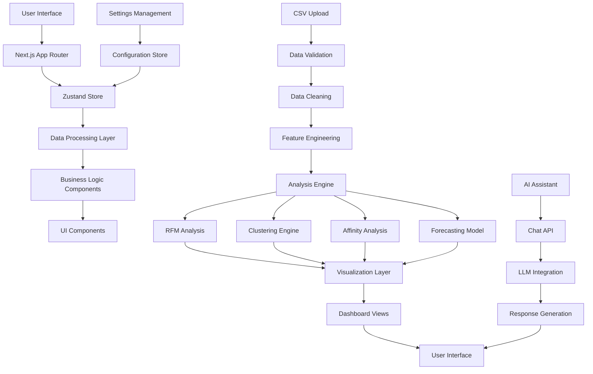
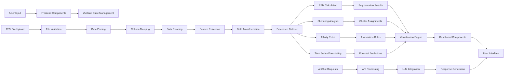
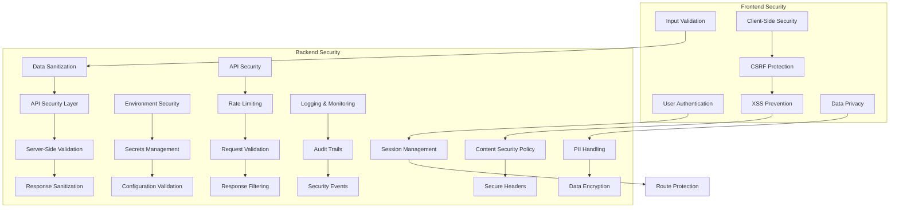

# ShopIQ-AI-Retail-Intelligence-Platform-Praxis-2.0-Hackathon

A comprehensive data analytics platform with forecasting, shopper behavior analysis, and interactive visualizations built with Next.js and TypeScript.

## Features

- **Interactive Dashboard**: View and analyze your data with rich visualizations
- **Revenue Forecasting**: Predictive analytics using machine learning models
- **Shopper Behavior Analysis**: Advanced customer segmentation using RFM analysis and clustering
- **Market Basket Analysis**: Discover product affinities and purchasing patterns
- **Data Upload & Processing**: Upload CSV files and automatically process them
- **AI Assistant**: Integrated AI-powered insights and recommendations
- **Responsive Design**: Works seamlessly across desktop and tablet devices

## Tech Stack

- **Framework**: [Next.js](https://nextjs.org/) 16.1.6
- **Language**: [TypeScript](https://www.typescriptlang.org/)
- **Styling**: [Tailwind CSS](https://tailwindcss.com/) with custom components
- **UI Components**: [Radix UI](https://www.radix-ui.com/) primitives
- **Charts**: [Recharts](https://recharts.org/)
- **State Management**: [Zustand](https://docs.pmnd.rs/zustand/getting-started/introduction)
- **Icons**: [Lucide React](https://lucide.dev/)
- **AI Integration**: @ai-sdk/react for AI assistant functionality

## Views

The application provides multiple perspectives for data analysis:

- **Dashboard**: Overview of key metrics and visualizations
- **Forecast**: Revenue predictions and model performance metrics
- **Comparison**: Side-by-side data comparison capabilities
- **Behavior**: Detailed shopper behavior and segmentation analysis
- **Upload**: Data import and preprocessing workflow
- **Settings**: Application configuration options

## Installation

1. Clone the repository:
   ```bash
   git clone <repository-url>
   ```

2. Install dependencies:
   ```bash
   npm install
   ```

3. Run the development server:
   ```bash
   npm  run dev
   ```

4. Open your browser to [http://localhost:3000](http://localhost:3000)

## Usage

### Getting Started
1. The application loads with prebuilt sample data for immediate exploration
2. Navigate between different views using the sidebar
3. Interact with charts and visualizations to explore data insights

### Uploading Your Own Data
1. Go to the Upload view from the sidebar
2. Select a CSV file containing your transaction data
3. Map your columns to the required fields (category, purchase amount, date, customer ID)
4. The application will process your data and update all visualizations

### Key Analytics Features
- **RFM Analysis**: Recency, Frequency, Monetary analysis for customer segmentation
- **Clustering**: Unsupervised learning to identify customer groups
- **Affinity Rules**: Market basket analysis to discover product relationships
- **Predictive Models**: Revenue forecasting with confidence intervals

## Project Structure

```
├── app/                    # Next.js app router pages
├── components/             # Reusable UI components
│   ├── ui/                 # Base UI components (buttons, cards, etc.)
│   └── views/              # Page-level components
├── lib/                    # Shared utilities and business logic
│   ├── store.ts            # Zustand store for state management
│   ├── types.ts            # Type definitions
│   ├── behavior-analysis.ts # Shopper behavior algorithms
│   └── data-processing.ts  # Data processing utilities
├── public/                 # Static assets
└── styles/                 # Global styles
```

## System Architecture

### System Flow Diagram



## Data Flow Diagram



## Security Architecture

### Security Diagram



## Contributing

1. Fork the repository
2. Create a feature branch (`git checkout -b feature/amazing-feature`)
3. Make your changes
4. Commit your changes (`git commit -m 'Add amazing feature'`)
5. Push to the branch (`git push origin feature/amazing-feature`)
6. Open a Pull Request

## Architecture Overview

### System Components

1. **Frontend Layer**
   - Next.js 16.1.6 with App Router
   - React 19.2.4 with TypeScript
   - Responsive UI with Tailwind CSS
   - Radix UI components for accessibility

2. **State Management**
   - Zustand for client-side state
   - Centralized store for application data
   - Reactive state updates

3. **Data Processing Layer**
   - CSV parsing and validation
   - Data cleaning and transformation
   - Feature engineering
   - Column mapping utilities

4. **Analytics Engine**
   - RFM (Recency, Frequency, Monetary) analysis
   - Customer clustering algorithms
   - Market basket analysis
   - Time series forecasting

5. **AI Integration**
   - @ai-sdk/react for LLM integration
   - Chat API endpoint (`/api/chat`)
   - Natural language processing
   - Intelligent insights generation

6. **Visualization Layer**
   - Recharts for data visualization
   - Interactive dashboard components
   - Real-time data updates
   - Responsive chart rendering

### Data Flow Architecture

1. **Data Ingestion**: Users upload CSV files through the Upload view
2. **Validation & Processing**: System validates data format and maps columns
3. **Analysis Pipeline**: Multiple analytics engines process the data
4. **Visualization**: Results are rendered through interactive components
5. **User Interaction**: Real-time updates based on user selections

### Security Considerations

- Input validation for all user data
- Secure handling of file uploads
- Client-side data processing (no server storage)
- Environment variable protection
- Secure API endpoint implementation
- XSS and CSRF protection measures
- Content Security Policy implementation

## License

This project is licensed under the MIT License - see the LICENSE file for details.

## Support

For support, please open an issue in the GitHub repository.